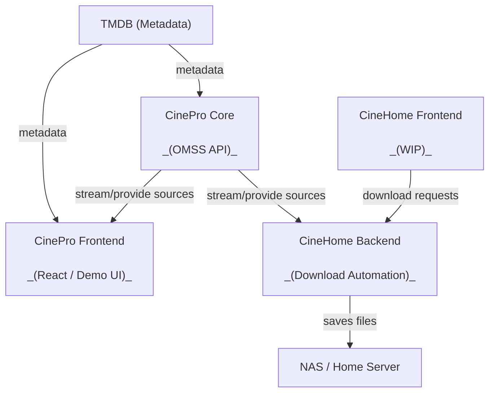

CinePro is more than a single API — it's a small, modular ecosystem of tools that work together. Each piece has a distinct role: a compliant backend, a demo frontend, and an automation layer for home media servers.

<CardGroup cols={2}>
  <Card title="CinePro Core" icon="server-cog" href="#cinepro-core">
    OMSS-compliant TypeScript backend. The engine of the whole ecosystem.
  </Card>
  <Card title="CinePro Frontend (WIP)" icon="monitor-play" href="#cinepro-frontend">
    Reference React UI built on top of Core. Useful for testing, not production.
  </Card>
  <Card title="CineHome Backend (WIP)" icon="hard-drive-download" href="#cinehome">
    Downloads movies and TV episodes to a folder on your home server or NAS.
  </Card>
  <Card title="CineHome Frontend (WIP)" icon="layout-dashboard" href="#cinehome">
    Next.js UI that sends download requests to the CineHome Backend.
  </Card>
</CardGroup>

---

## CinePro Core

CinePro Core is the heart of the ecosystem. It is a fully **OMSS-compliant** (Open Media Streaming Standard) streaming backend built in TypeScript using the [`@omss/framework`](https://www.npmjs.com/package/@omss/framework). Its job is to find and return playable streaming sources for movies and TV shows identified by TMDB IDs.

<CardGroup cols={2}>
  <Card title="OMSS-Compliant" icon="circle-check">
    Follows the Open Media Streaming Standard specification for a consistent, interoperable API contract.
  </Card>
  <Card title="Modular Provider System" icon="plug">
    Drop-in provider folders under `src/providers/` with auto-discovery. Ships with built-in providers.
  </Card>
  <Card title="Production-Ready" icon="server">
    Redis caching, Docker + Docker Compose support, TypeScript strict mode, and full error handling baked in.
  </Card>
  <Card title="Type-Safe" icon="shield-check">
    Full TypeScript implementation with strict types end-to-end for reliable provider development.
  </Card>
</CardGroup>

<Info>
  CinePro Core requires a **TMDB API key** to resolve metadata. You can get one for free at [themoviedb.org/settings/api](https://www.themoviedb.org/settings/api).
</Info>

**Quick links:**
- [GitHub → cinepro-org/core](https://github.com/cinepro-org/core)
- [Quickstart guide](/quickstart)
- [Configuration reference](/core/configuration/environment)
- [Provider system](/core/configuration/providers)

---

## CinePro Frontend

The CinePro Frontend is a **React + Vite demo application** that connects directly to a running Core instance via the `VITE_API_URL` environment variable. It demonstrates how to consume the Core API in a real browser context.

<Warning>
  This frontend is **not intended for production or large-scale use**. It was built for testing and reference purposes. The README itself notes: *"it has only been made for testing purposes."*
</Warning>

It supports:

- Browsing and watching movies and TV shows
- Video streaming via [HLS.js](https://github.com/video-dev/hls.js)
- Responsive design

Think of it as a working proof-of-concept — a starting point for building your own UI on top of Core, not a finished product.

**Quick links:**
- [GitHub → cinepro-org/frontend](https://github.com/cinepro-org/frontend)
- [Frontend quickstart](/frontend/quickstart)
- [Frontend pages & components](/frontend/pages)

---

## CineHome

CineHome is a two-part automation stack — a backend service and a Next.js frontend — that lets you **automatically download movies and TV episodes** to a predefined folder on a running system such as a NAS or home server. It uses CinePro Core to resolve sources and then downloads the media locally.

<CardGroup cols={2}>
  <Card title="CineHome Backend" icon="hard-drive-download" href="https://github.com/cinepro-org/CineHome-backend">
    Node.js service that receives download requests and uses the CinePro Core API to resolve and download media to a local folder.
  </Card>
  <Card title="CineHome Frontend" icon="layout-dashboard" href="https://github.com/cinepro-org/CineHome-frontend">
    Next.js UI that communicates with the CineHome Backend via `NEXT_PUBLIC_CINEHOMEBACKEND`. Used to queue and manage downloads.
  </Card>
</CardGroup>

<Note>
  CineHome is tightly coupled to CinePro Core. Make sure your Core instance is running and reachable before setting up CineHome.
</Note>

**Setup overview:**

<Steps>
  <Step title="Run CinePro Core">
    Deploy Core with a valid `TMDB_API_KEY`. See the [Core quickstart](/quickstart) for full instructions.
  </Step>
  <Step title="Deploy CineHome Backend">
    Clone [cinepro-org/CineHome-backend](https://github.com/cinepro-org/CineHome-backend), configure it to point at your Core instance, and start the service.
  </Step>
  <Step title="Deploy CineHome Frontend">
    Clone [cinepro-org/CineHome-frontend](https://github.com/cinepro-org/CineHome-frontend), set `NEXT_PUBLIC_CINEHOMEBACKEND` to your CineHome Backend URL, and run `npm run dev` or build for production.
  </Step>
</Steps>

---

## How the pieces fit together

---

## Community & Discussions

CinePro is actively maintained and open to contributors. The best place to get help, propose features, or discuss new providers is the GitHub Discussions board.

<CardGroup cols={2}>
  <Card title="GitHub Discussions" icon="users" href="https://github.com/orgs/cinepro-org/discussions">
    Ask questions, share ideas, and connect with contributors.
  </Card>
  <Card title="Contribute to Core" icon="git-pull-request" href="https://github.com/cinepro-org/core">
    New providers, bug fixes, performance improvements, and docs are all welcome. Open a PR on the core repo.
  </Card>
</CardGroup>

<Tip>
  The most impactful contributions right now are **new provider implementations**. Check the existing providers under `src/providers/` in the core repo for the reference pattern.
</Tip>